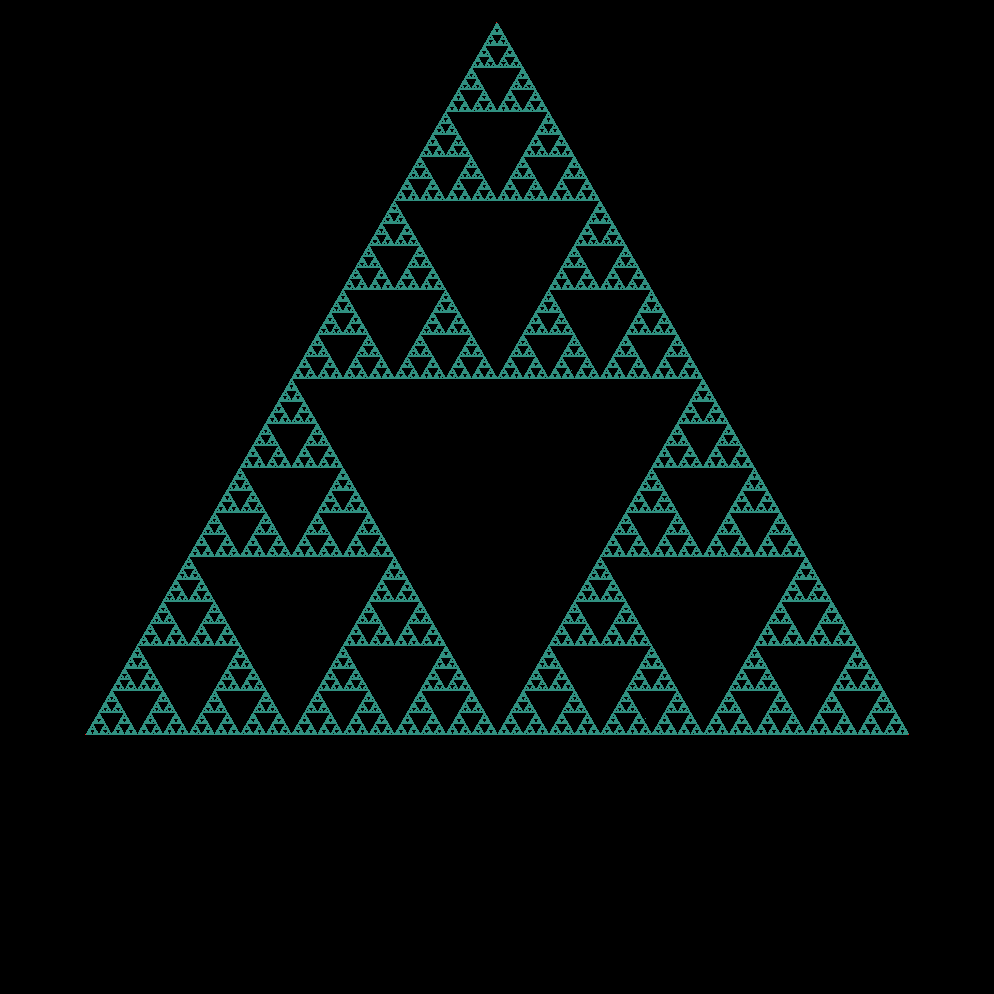
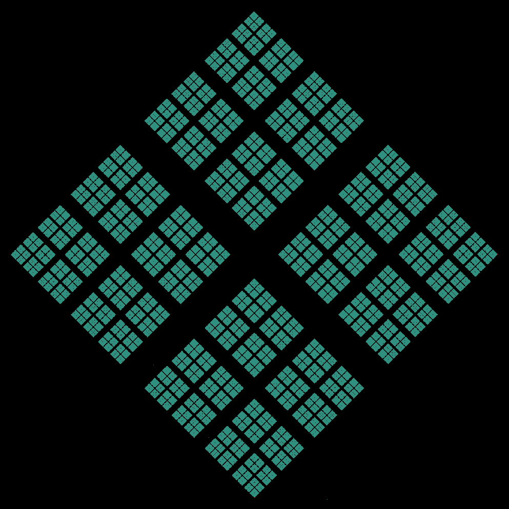
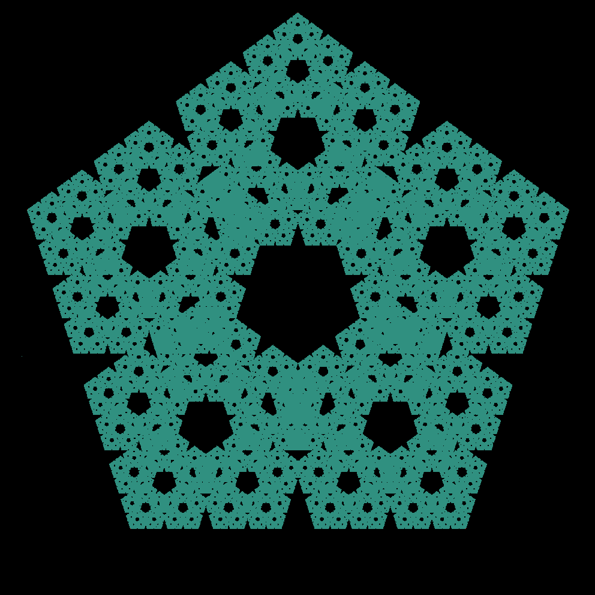
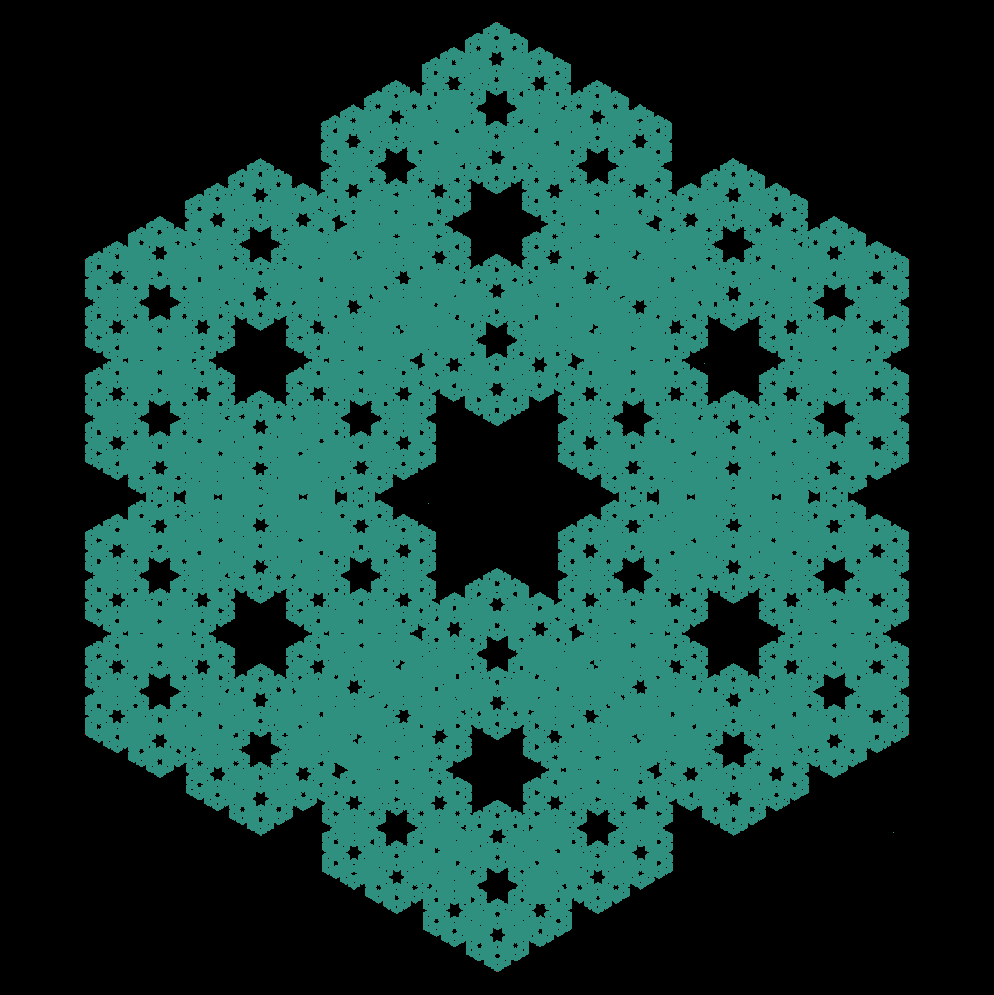

# Chaos Game

This program draws fractals generated by a simple implementation of the chaos game. Visit <a href="https://en.wikipedia.org/wiki/Chaos_game">Wikipedia</a> for details.

Dependencies
-----
*	<b>g++</b>
*	<a href="https://www.libsdl.org/download-2.0.php"><b>SDL2.0</b></a>

Usage
-----
Build with ```make```, then run with ```./chaos [OPTIONS]```

Options:

*	```-v N | --vertices N```: Number of vertices in the polygon (default: 3)
*	```-f N | --fraction N```: Fraction of distance between the current point and chosen vertex to place a new point (default: 0.5)
*	```-s N | --stepping N```: Number of points to generate before refreshing the window (default: 2500). Greatly affects draw speed
*	```-d N | --frame-delay N```: Delay in ms after the window is refreshed (default: 50)
*	```--dimensions XxY```: Screen dimensions (default: 1000x1000)
*	```-h | --help```: Display the help page

Examples
-----
<p align="middle">
  
   
</p>
<br>
<p align="middle">
   
   
</p>
<br>
<p align="middle">
   
   
</p>