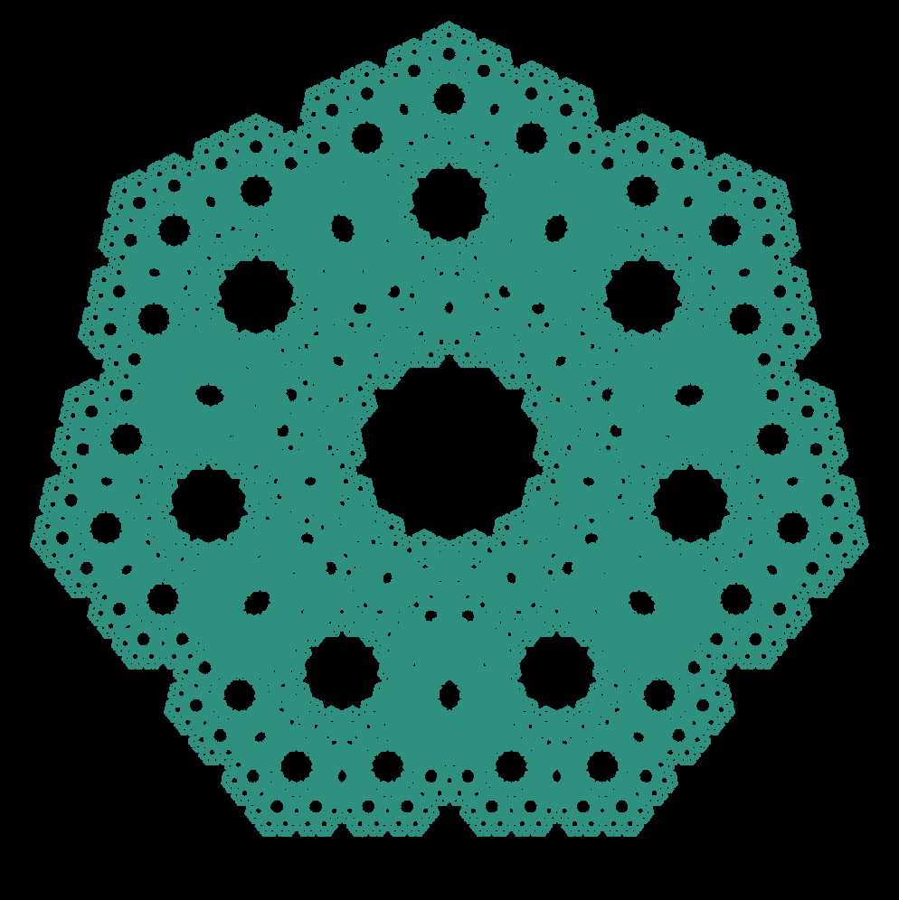
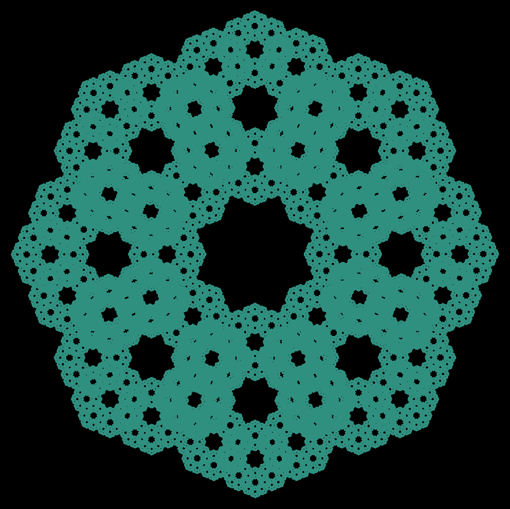

# Chaos Game

This program draws fractals generated by a simple implementation of the Chaos Game. Visit https://en.wikipedia.org/wiki/Chaos_game for details.

Dependencies
-----
*	<a href="https://www.libsdl.org/download-2.0.php"><b>SDL2.0</b></a>

Usage
-----
Build with:
```
g++ main.cpp -lSDL2 -std=c++11 -O3 -o chaos
```

Run with:
```
./chaos [OPTIONS]
```

Options:
*	```-v N```: Number of vertices in the polygon (default: 3)
*	```-f N```: Fraction of distance between the current point and chosen vertex to place a new point (default: 0.5)
*	```-s N```: Number of points to generate before refreshing the window (default: 2500). Greatly affects draw speed
*	```-d N```: Delay in ms after the window is refreshed (default: 50)
*	```-h```: Display the help page

Examples
-----
<p align="middle">
  
   
</p>
<br>
<p align="middle">
   
   
</p>
<br>
<p align="middle">
   
   
</p>